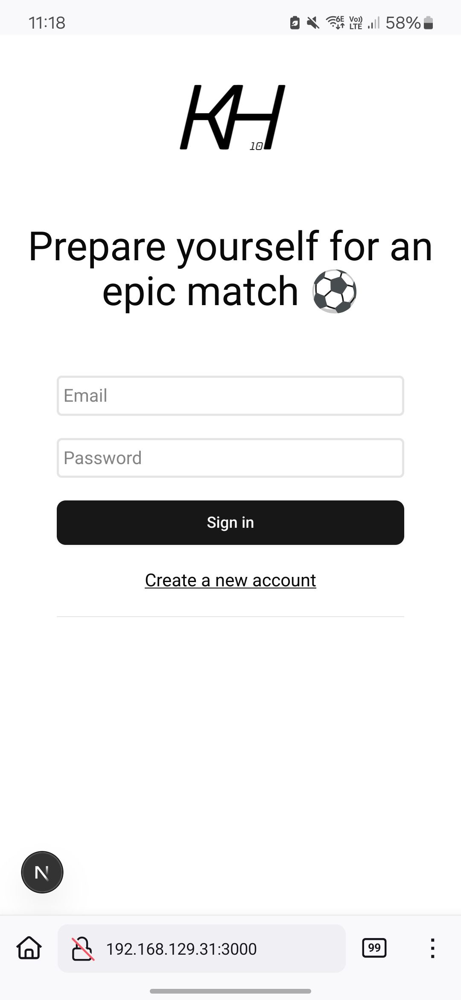
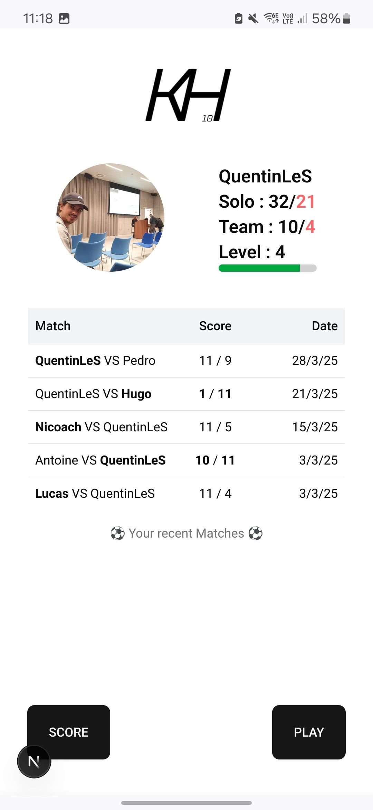
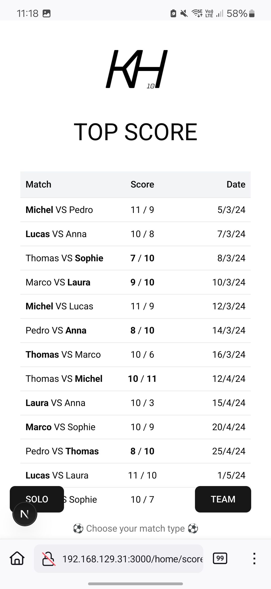
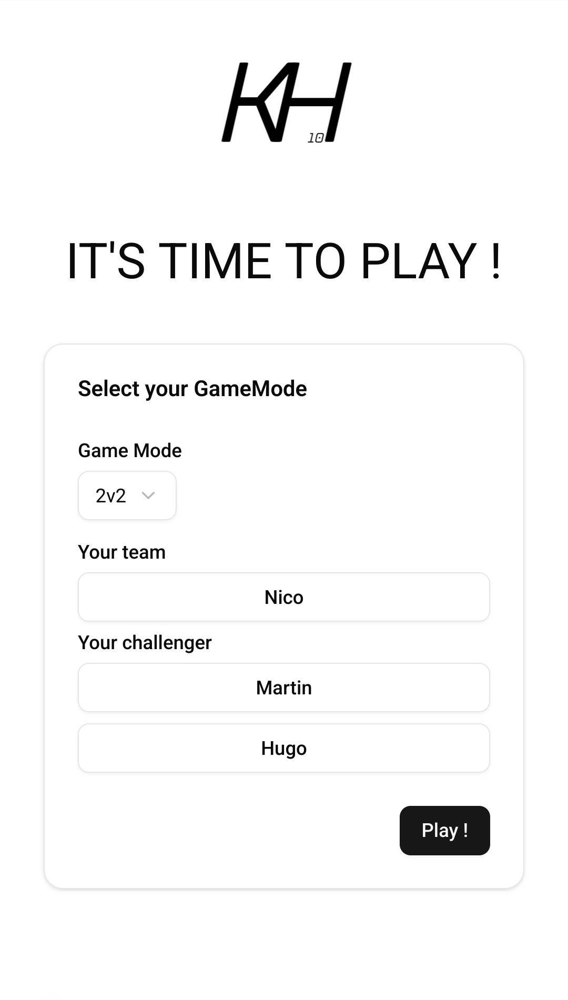

# 🏆 Hamilton10Kicker

### *Ajoute du fun et de la compétition à tes parties de kicker dans l'open space !*

---

## 🌟 **Description du projet**

*Les cases coché **[x]** c'est ce qui sera dans le MVP*

Le **Hamilton10Kicker** est une application web pensée pour transformer ton kicker en une arène de compétition !

Tu peux :

- Enregistrer tes scores.
- [x] Voir un classement des joueurs (solo ou en équipe).
- [x] Garder un historique complet des parties.
- [x] Profiter d’une interface ludique et accessible directement depuis ton téléphone.

➡ **Objectif :** Ne jamais oublier les scores et permettre à tout le monde de suivre son évolution. 🎯

---

## 🚀 **Fonctionnalités principales**

### **1. Leaderboard (Classement)**

- 📊 Classement des joueurs **en solo** ou **par équipe**.
- 🏅 Statistiques clés :
    - [x] Nombre de matchs gagnés/perdus.
    - Nombre de buts marqués.
    - [x] Ratio de victoire.

### **2. Profils joueurs et équipes**

- [x] Crée ton profil joueur avec un pseudo et des stats personnalisées.
- [x] Forme des équipes pour encore plus de fun !

### **3. Historique des parties**

- Suis les parties jouées grâce à :
    - [x] 🕒 Date.
    - [x] ⚽ Nombre de buts.
    - [x] 🏆 Vainqueur.

### **4. Interface dynamique et ludique**

- [x] Mobile-first, pensée pour une utilisation rapide entre deux matchs.
- Une page de victoire fun pour célébrer les gagnants et rejouer !

---

## 🎨 **Screenshots du projet (Work in Progress)**

---

## 🛠️ **Technologies utilisées**

- **Frontend** : NextJS
- **Backend** : Express Ts/TypeORM
- **Base de données** : MariaDb

---

## 📖 **Installation et configuration**

### **Pré-requis**

- Node.js >= 16.x
- NPM
- Une base de données MariaDb

---

## 📚 **Roadmap**

### **Version actuelle (v0.9)** :

- Login register fonctionnel
- Toute l'interface fonctionne avec des fakes data

### **Prochaines étapes** :

- Implémenter le backend
- 🎨 Améliorer l’UI/UX avec des animations fun.

---

## 🤝 **Contributions**

Les contributions sont les bienvenues ! 🚀

Voici comment contribuer :

1. **Fork le projet**.
2. Crée une nouvelle branche : `git checkout -b feature/nouvelle-fonctionnalite`.
3. Fais tes modifications et commit : `git commit -m "Ajout de la nouvelle fonctionnalité"`.
4. Pousse la branche : `git push origin feature/nouvelle-fonctionnalite`.
5. Ouvre une Pull Request 

---

## ⭐ **Lâche une étoile !**

Si tu aimes ce projet ou si tu l’utilises, n’hésite pas à lui mettre une ⭐ sur GitHub. Ça motive ! 😊

*Cette description a été en partie faite par une IA.*
